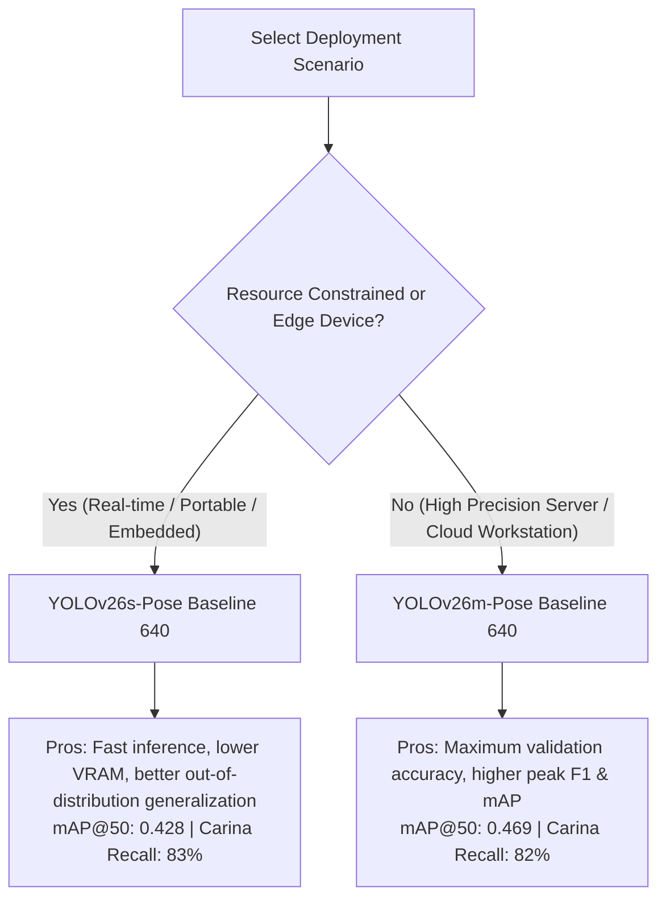

# YOLO-Pose Carina Point Detection

Detecting Carina Anatomical Landmarks from Medical Chest X-ray and Angiography Images using AI-Assisted Pose Estimation.

---

## Table of Contents

- [Project Overview](#project-overview)
- [Dataset: `dataset_696`](#dataset-dataset_696)
  - [Iterative Curation & Active Learning Workflow](#iterative-curation--active-learning-workflow)
  - [Anatomical Landmark Schema (5 Keypoints)](#anatomical-landmark-schema-5-keypoints)
  - [Dataset Structure & Formatting](#dataset-structure--formatting)
- [Scripts & Automation Pipeline](#scripts--automation-pipeline)
  - [Pipeline Overview](#pipeline-overview)
  - [Detailed Script Descriptions](#detailed-script-descriptions)
- [Model Training Configurations](#model-training-configurations)
  - [Model Variants](#model-variants)
  - [Experimental Runs & Settings](#experimental-runs--settings)
- [Evaluation Metrics & Model Comparisons](#evaluation-metrics--model-comparisons)
  - [Comprehensive Comparison Table](#comprehensive-comparison-table)
  - [In-Depth Performance Analysis](#in-depth-performance-analysis)
  - [Unseen 50-Image Evaluation & Generalization](#unseen-50-image-evaluation--generalization)
  - [Model Selection Trade-offs & Clinical Recommendations](#model-selection-trade-offs--clinical-recommendations)
- [How to Run](#how-to-run)
  - [Environment Setup](#environment-setup)
  - [Data Preparation & Conversion](#data-preparation--conversion)
  - [Training & Inference](#training--inference)
- [Author & Acknowledgements](#author--acknowledgements)

---

## Project Overview

Manual annotation of anatomical landmarks in medical imaging is labor-intensive, time-consuming, and subject to inter-observer variability. The **Carina** — the anatomical ridge located at the bifurcation where the trachea divides into the left and right main bronchi — is a critical reference landmark for:
- **Endotracheal Tube (ETT) Placement:** Ensuring safe positioning above the carina to avoid endobronchial intubation.
- **Central Venous Catheter (CVC) Positioning:** Verifying tip placement relative to the cavoatrial junction.
- **Airway & Tracheobronchial Assessment:** Quantifying tracheobronchial angles and airway geometry.

Traditional object detection methods approximate landmarks using bounding boxes, which lack spatial precision. This project frames landmark localization as a **Keypoint Pose Estimation** problem using the **Ultralytics YOLO-Pose** framework, achieving coordinate-level precision, rapid inference speeds, and seamless integration into a human-in-the-loop active learning workflow.

```mermaid
flowchart LR
    A["Raw Medical Images (~2,000)"] --> B["Screening & Dedup"]
    B --> C["Shortlisted Pool (292)"]
    C --> D["Initial Annotation (150)"]
    D --> E["Train YOLO-Pose Model"]
    E --> F["Predict on Unseen Images"]
    F --> G["Import into Label Studio"]
    G --> H["Manual Verification & Correction"]
    H --> I["Iterative Retraining (5 Rounds)"]
    I --> J["Final Dataset: dataset_696"]
```



---

## Dataset: `dataset_696`

### Iterative Curation & Active Learning Workflow

`dataset_696` is the final curated dataset produced through a 5-round iterative active learning lifecycle:

1. **Initial Screening & Pooling:** ~2,000 unlabelled medical chest X-ray and fluoroscopy/angiography images were pooled from clinical image archives.
2. **Visual Triage & Deduplication:** Images were screened via contrast-enhanced contact sheets (`contact_sheet.py`) and deduplicated using perceptual hashing (`dedup.py`), producing a shortlisted subset of **292 high-quality candidate images**.
3. **Seed Annotation:** An initial set of **150 images** was manually annotated with 5 anatomical keypoints in Label Studio.
4. **Semi-Automated Iteration (5 Rounds):**
   - Models trained on current labelled subsets generated predictions on unlabelled batches.
   - Predictions were converted back into Label Studio pre-annotations (`convert2p.py`).
   - Annotators reviewed, corrected, and confirmed keypoint coordinates.
   - Verified labels were incorporated into retraining.
5. **Final Dataset Assembly:** The process culminated in **696 clinically validated, high-quality labelled images**.

### Anatomical Landmark Schema (5 Keypoints)

Each image is annotated with **5 ordered anatomical keypoints** capturing the tracheal midline and bronchial bifurcation geometry:

```
        (4) Centre1 [Upper Trachea]
             |
        (3) Centre2 [Lower Trachea]
             |
        (0) Carina  [Tracheal Bifurcation]
           /       \
 (1) Left           (2) Right
[Left Bronchus]    [Right Bronchus]
```

| Keypoint Index | Landmark Name | Anatomical Description | Skeletal Link |
|:--------------:|:-------------:|:-----------------------|:-------------:|
| **0** | `Carina` | Main apex of the tracheal bifurcation (primary target) | Connected to `Left`, `Right`, `Centre2` |
| **1** | `Left` | Lateral landmark on the left main bronchus | `[0, 1]` |
| **2** | `Right` | Lateral landmark on the right main bronchus | `[0, 2]` |
| **3** | `Centre2` | Lower intermediate tracheal midline reference point | `[0, 3]`, `[3, 4]` |
| **4** | `Centre1` | Upper tracheal midline reference point | `[3, 4]` |

### Dataset Structure & Formatting

The dataset follows the standard Ultralytics YOLO-Pose format:

```
dataset_696/
├── data.yaml
├── images/
│   ├── train/     # Training images (80% split)
│   └── val/       # Validation images (20% split)
└── labels/
    ├── train/     # YOLO pose .txt annotations (matching train images)
    └── val/       # YOLO pose .txt annotations (matching val images)
```

#### `data.yaml` Configuration
```yaml
path: dataset_696
train: images/train
val: images/val

names:
  0: Carina

kpt_shape: [5, 3]
flip_idx: [0, 1, 2, 3, 4]

keypoints:
  - Carina
  - Left
  - Right
  - Centre2
  - Centre1

skeleton:
  - [0, 1]
  - [0, 2]
  - [0, 3]
  - [3, 4]
```

#### Label Format (.txt)
Each text file contains a 20-column space-delimited vector:
$$\text{class\_id} \quad c_x \quad c_y \quad b_w \quad b_h \quad (x_1, y_1, v_1) \quad (x_2, y_2, v_2) \quad (x_3, y_3, v_3) \quad (x_4, y_4, v_4) \quad (x_5, y_5, v_5)$$

- Coordinates ($c_x, c_y, b_w, b_h, x_i, y_i$) are normalized to $[0.0, 1.0]$ relative to image dimensions.
- Visibility flag $v_i \in \{0, 1, 2\}$ ($2$ = labeled & visible, $0$ = absent / occluded).

---

## Scripts & Automation Pipeline

### Pipeline Overview

The repository contains 11 dedicated Python scripts facilitating end-to-end dataset curation, format transformation, active learning integration, splitting, and verification:

| Category | Script | Primary Purpose |
|:---|:---|:---|
| **Data Ingestion & Triage** | `contact_sheet.py` | Generates thumbnail contact sheets with filename labels for rapid visual screening |
| | `dedup.py` | Perceptual hash (`pHash`) deduplication to prune duplicate/blurred medical images |
| **Annotation & Format Conversion** | `conversion.py` | Converts Label Studio JSON exports to YOLO-Pose `.txt` labels with auto-computed bounding boxes |
| | `conversion_2json.py` | Converts YOLO-Pose prediction `.txt` files into intermediate structured JSON |
| | `convert2p.py` | Converts prediction JSON into Label Studio import format (`predictions.json`) with linked keypoints |
| **Dataset Organization & Maintenance** | `image_selection.py` | Selects/copies specific image subsets and automates image-label pairing for new training rounds |
| | `labell.py` | Matches downloaded label identifiers to image pools and segregates confirmed labelled images |
| | `rename.py` | Strips hash prefixes from Label Studio export filenames (`hash-imgno.txt` $\rightarrow$ `imgno.txt`) |
| | `rename_images.py` | Fixes duplicate copy names (`1(2).png`) and safely renumbers images and labels sequentially |
| | `split.py` | Deterministically splits paired images and labels into train/val sets (80/20 or 90/10) |
| **Quality Control & Visualization** | `visualise.py` | Overlays bounding boxes and 5 keypoints onto images for visual audit and verification |

---

### Detailed Script Descriptions

#### 1. `conversion.py` — Label Studio to YOLO-Pose Converter
- **Input:** Label Studio exported JSON (`project-*.json`).
- **Functionality:**
  - Extracts keypoint annotations across top-level annotations, embedded predictions, and top-level predictions.
  - Enforces the strict canonical keypoint ordering: `["Carina", "Left", "Right", "Centre1", "Centre2"]`.
  - Automatically calculates tight bounding box extents ($x_{\min}, y_{\min}, x_{\max}, y_{\max}$) with configurable margin padding (`PADDING = 0.02`).
  - Generates the 20-column YOLO-Pose text files with visibility flags ($v=2$ for present, $v=0$ for missing).
- **Output:** Individual YOLO-format `.txt` label files in target label directory.

#### 2. `conversion_2json.py` — YOLO Predictions to Intermediate JSON
- **Input:** Directory of predicted YOLO-Pose `.txt` files (`predicted_package/labels`).
- **Functionality:**
  - Parses YOLO format lines into structured dictionary objects containing class ID, bounding box parameters (`x_center`, `y_center`, `width`, `height`), and 5 keypoint coordinates with visibility flags.
  - Validates line length consistency ($5 + 5 \times 3 = 20$ elements).
- **Output:** Structured `.json` annotation files per image in `json_labels_*/`.

#### 3. `convert2p.py` — Pre-Annotation Generator for Label Studio
- **Input:** Image directories and intermediate prediction JSON files (`json_labels_1/`).
- **Functionality:**
  - Constructs Label Studio pre-annotation payload format.
  - Converts normalized YOLO coordinates back to Label Studio percentage coordinate space ($0 - 100\%$).
  - Creates parent `rectanglelabels` objects and child `keypointlabels` objects linked by `parentID: bbox_id`.
- **Output:** `predictions.json` ready for direct upload into Label Studio for active learning verification.

#### 4. `contact_sheet.py` — Visual Screening Sheet Generator
- **Input:** Directory of raw unlabelled medical images (`images/val`, `images/train`).
- **Functionality:**
  - Scans across all common image extensions (`.jpg`, `.jpeg`, `.png`, `.bmp`, `.tif`).
  - Applies automated histogram contrast stretching (`ImageOps.autocontrast`) to clarify anatomical structures.
  - Renders 10-image thumbnail grid sheets ($2 \text{ cols} \times 5 \text{ rows}$, thumbnail size 420 px) with embedded red filename stems.
- **Output:** High-resolution contact sheets (`contact_sheets/sheet_V_000.jpg`) enabling rapid manual image selection.

#### 5. `dedup.py` — Perceptual Image Deduplication
- **Input:** Raw image directory (`images/train`).
- **Functionality:**
  - Computes 64-bit perceptual image hashes using `imagehash.phash()`.
  - Measures pairwise Hamming distance against previously indexed hashes.
  - Drops near-duplicate frames and duplicate scans within threshold distance (`THRESHOLD = 5`).
- **Output:** Deduplicated image directory (`dedup/`), preventing data leakage between train/val splits.

#### 6. `image_selection.py` — Dataset Curation & Image-Label Pairing
- **Input:** Shortlisted image IDs and unlabelled image directories.
- **Functionality:**
  - Utility 1: Copies explicit lists of shortlisted image IDs from pool folders to target training subsets.
  - Utility 2: Iterates through generated `.txt` labels in label folders (e.g. `labels_3/train_3`), matches corresponding images from unlabelled folders (`unlabelled_3`), and copies validated pairs to combined dataset directories (`dataset_t/images`, `dataset_t/labels`).
- **Output:** Synchronized image-label pairs in preparation for new training rounds.

#### 7. `labell.py` — Label Matching & Image Segregation
- **Input:** Downloaded Label Studio export label files (`labels/train_1/*.txt`) and selected image pool (`images/selected/`).
- **Functionality:**
  - Extracts image numbers from label filenames with prefix hashes (e.g. `image-123.txt` $\rightarrow$ `123`).
  - Searches for matching image files across multiple extensions (`.jpg`, `.png`, `.bmp`, `.webp`).
  - Moves matched image files to a dedicated `labelled/` directory.
- **Output:** Segregated folder of confirmed labelled images.

#### 8. `rename.py` — Label Studio Filename Normalization
- **Input:** Label Studio exported labels (`labels_3/train_3`) and corresponding images (`unlabelled_3`).
- **Functionality:**
  - Removes non-standard random hash strings added during Label Studio exports (e.g. `d3f4a1-42.txt` $\rightarrow$ `42.txt`).
  - Verifies presence in the image map before renaming, flagging any orphaned label files.
- **Output:** Clean, matching label filenames aligned with image stems.

#### 9. `rename_images.py` — Copy Cleanup & Sequential Re-Indexing
- **Input:** Scattered image and label folders (`dataset_3/images`, `dataset_3/labels`).
- **Functionality:**
  - Routine 1: Detects copy-paste duplicate patterns (e.g. `1(2).png`) using regex and offsets IDs (`1001.png`).
  - Routine 2: Executes a 2-phase atomic sequential rename (Phase 1: `temp_i.*`, Phase 2: `1.*`, `2.*`, ..., `N.*`) across both images and labels simultaneously to prevent collision.
- **Output:** Continuously numbered, synchronized dataset directory.

#### 10. `split.py` — Deterministic Train/Val Splitting
- **Input:** Combined paired dataset directory (`dataset_3/images`, `dataset_3/labels`).
- **Functionality:**
  - Scans paired image-label matches (ensuring only images with valid `.txt` labels are included).
  - Shuffles data using a fixed random seed (`random.seed(42)`) for complete reproducibility.
  - Splits pairs according to specified ratios (e.g. 80% train / 20% validation or 90% train / 10% validation).
  - Copies files into `images/train`, `images/val`, `labels/train`, `labels/val`.
- **Output:** Fully partitioned YOLO training dataset.

#### 11. `visualise.py` — Bounding Box & Keypoint Overlay
- **Input:** Image folder, label folder, output destination folder, optional `--only` target list.
- **Functionality:**
  - Reads YOLO `.txt` labels and denormalizes coordinates against image width ($W$) and height ($H$).
  - Draws bounding boxes with distinct instance color palettes.
  - Overlays all 5 keypoints with filled circle markers and outlines.
- **Usage:**
  ```bash
  python visualise.py images/ labels/ preview_out/ --only 101.jpg 102.jpg
  ```
- **Output:** Rendered images for visual quality inspection and verification of keypoint-box alignment.

---

## Model Training Configurations

### Model Variants

Two model architectures from the YOLO-Pose family were trained and benchmarked independently:
1. **YOLOv26s-Pose (Small):** Lightweight architecture with ~9.3M parameters. Optimized for fast inference and lower compute footprints.
2. **YOLOv26m-Pose (Medium):** Medium-scale architecture with ~20.5M parameters. Offers higher feature extraction capacity and localization fidelity.

### Experimental Runs & Settings

All models were evaluated across **3 distinct experimental settings** on `dataset_696` to isolate the effects of model capacity, image resolution, and spatial augmentation:

```
                                  ┌── Baseline 640 (imgsz=640, standard aug, 100 epochs)
                                  │
Training Configurations (6 runs) ─┼── Resolution 768 (imgsz=768, standard aug, 150 epochs)
                                  │
                                  └── Augmentation 640 (imgsz=640, custom spatial aug, 150 epochs)
                                        [degrees=5°, translate=0.05, scale=0.30, fliplr=0.5]
```

1. **Run 1 — Baseline 640:**
   - Image resolution: `imgsz = 640`
   - Epochs: `100` | Batch size: `16` | Optimizer: `auto`
   - Augmentations: Standard YOLO defaults (`degrees=0.0`, `translate=0.1`, `scale=0.5`, `fliplr=0.5`, `mosaic=1.0`).
2. **Run 2 — Resolution 768:**
   - Image resolution: `imgsz = 768` (20% higher spatial input resolution)
   - Epochs: `150` | Batch size: `16` | Optimizer: `auto`
   - Augmentations: Standard YOLO defaults.
3. **Run 3 — Augmentation 640:**
   - Image resolution: `imgsz = 640`
   - Epochs: `150` | Batch size: `16` | Optimizer: `auto`
   - Augmentations: Constrained medical spatial augmentations (`degrees = 5.0°`, `translate = 0.05`, `scale = 0.30`, `fliplr = 0.5`).

---

## Evaluation Metrics & Model Comparisons

### Comprehensive Comparison Table

The table below provides a full comparative breakdown across all 6 training configurations (2 model architectures $\times$ 3 experimental settings), comparing Pose and Box metrics alongside Carina Confusion Matrix detection rates:

| Model | Experimental Setting | Input Size | Epochs | Pose mAP@0.50 | Pose mAP@0.50–0.95 | Pose Precision | Pose Recall | Box mAP@0.50 | Box mAP@0.50–0.95 | Carina Detection Rate (CM) |
|:---|:---|:---:|:---:|:---:|:---:|:---:|:---:|:---:|:---:|:---:|
| **YOLOv26s-Pose** | **Baseline** | 640 | 100 | **0.428** | **~0.39** (0.388) | 0.487 | 0.474 | 0.390 | 0.178 | **0.83 (83%)** |
| **YOLOv26m-Pose** | **Baseline** | 640 | 100 | **0.469** | **~0.41** (0.416) | **0.512** | **0.526** | **0.417** | **0.194** | **0.82 (82%)** |
| **YOLOv26s-Pose** | **Resolution** | 768 | 150 | ~0.42 (0.410) | ~0.39 (0.388) | 0.514 | 0.500 | 0.371 | 0.181 | 0.47 (47%) |
| **YOLOv26m-Pose** | **Resolution** | 768 | 150 | ~0.44 (0.430) | ~0.40 (0.401) | 0.582 | 0.444 | 0.400 | 0.185 | 0.48 (48%) |
| **YOLOv26s-Pose** | **Augmentation** | 640 | 150 | ~0.41 (0.411) | ~0.38 (0.387) | 0.505 | 0.442 | 0.362 | 0.173 | 0.43 (43%) |
| **YOLOv26m-Pose** | **Augmentation** | 640 | 150 | ~0.40 (0.415) | ~0.38 (0.390) | 0.503 | 0.469 | 0.386 | 0.171 | 0.39 (39%) |

> [!NOTE]
> Values above reflect validation evaluations at training convergence and best checkpoint epochs. "Carina Detection Rate (CM)" represents true positive rate of Carina landmark detection from confusion matrix evaluation.

---

### In-Depth Performance Analysis

#### 1. Model Capacity Impact (YOLOv26s vs YOLOv26m)
- **Baseline Accuracy:** YOLOv26m-Pose consistently outperformed YOLOv26s-Pose in validation accuracy across all settings. Under baseline 640 conditions, YOLOv26m improved **Pose mAP@0.50 from 0.428 to 0.469** (+4.1 percentage points) and **Pose mAP@0.50–0.95 from ~0.39 to ~0.41**.
- **Precision & Recall:** YOLOv26m achieved higher precision (0.512 vs 0.487) and higher recall (0.526 vs 0.474), reflecting stronger landmark localization and lower false-positive rates.
- **Carina Detection Reliability:** Both baseline models demonstrated robust Carina identification on validation data (**83% for v26s** vs **82% for v26m**).

#### 2. Input Resolution Impact (640 vs 768)
- Scaling input resolution from 640 to 768 increased computational load significantly (+44% pixel area per image) but **did not yield mAP improvements**:
  - YOLOv26s: Pose mAP@0.50 declined from 0.428 to ~0.410.
  - YOLOv26m: Pose mAP@0.50 declined from 0.469 to ~0.430.
- Furthermore, the higher resolution configuration showed a significant drop in Carina confusion matrix detection rate (down to ~47–48%), likely caused by scale discrepancy and overfitting given the limited training sample size (696 images).

#### 3. Spatial Augmentation Impact
- Testing restricted spatial augmentations (`degrees=5°`, `translate=0.05`, `scale=0.30`) reduced pose estimation performance across both architectures:
  - YOLOv26s: Pose mAP@0.50 dropped to ~0.411.
  - YOLOv26m: Pose mAP@0.50 dropped to ~0.400–0.415.
- The default YOLO augmentation suite (incorporating moderate scaling and translation) provides better regularization for anatomical landmark detection than rigid angle-constrained augmentations.

---

### Unseen 50-Image Evaluation & Generalization

In addition to validation set evaluations, both models were tested against a separate **unseen evaluation set of 50 external medical images**:

> [!IMPORTANT]
> **Key Generalization Finding:** While **YOLOv26m-Baseline achieved the highest pose validation metrics** on the internal validation split (mAP@50 = 0.469), **YOLOv26s generalized better on the separate 50-image unseen test set**, demonstrating higher robustness against out-of-distribution image contrast variations, differing patient orientations, and scanner noise.

---

### Model Selection Trade-offs & Clinical Recommendations



- **For Resource-Constrained / Edge Clinical Systems:** **YOLOv26s-Pose (Baseline 640)** is recommended. It delivers 83% Carina detection accuracy with a lightweight memory footprint and superior generalization on unseen medical scans.
- **For Centralized High-Accuracy Diagnostic Pipelines:** **YOLOv26m-Pose (Baseline 640)** is the preferred choice when maximizing landmark coordinate precision (Pose mAP@0.50 = 0.469) is the primary objective.

---

## How to Run

### Environment Setup

```bash
# Clone repository
git clone https://github.com/tammay-ss/YOLO-Pose_.git
cd YOLO-Pose_

# Install dependencies
pip install ultralytics pillow imagehash tqdm pyyaml opencv-python
```

### Data Preparation & Conversion

```bash
# 1. Convert Label Studio annotations to YOLO-Pose format
python conversion.py

# 2. Partition dataset into Train / Val splits (80/20)
python split.py

# 3. Visually audit keypoint and bounding box labels
python visualise.py dataset_696/images/val dataset_696/labels/val preview_out/
```

### Training & Inference

#### Train YOLOv26s-Pose Baseline
```python
from ultralytics import YOLO

model = YOLO("yolo26s-pose.pt")
results = model.train(
    data="dataset_696/data.yaml",
    epochs=100,
    imgsz=640,
    batch=16,
    name="v26s_baseline_640"
)
```

#### Train YOLOv26m-Pose Baseline
```python
from ultralytics import YOLO

model = YOLO("yolo26m-pose.pt")
results = model.train(
    data="dataset_696/data.yaml",
    epochs=100,
    imgsz=640,
    batch=16,
    name="v26m_baseline_640"
)
```

#### Predict & Export for Label Studio
```bash
# 1. Run predictions on unlabelled images
# (produces .txt prediction labels)

# 2. Convert predicted YOLO labels to intermediate JSON
python conversion_2json.py

# 3. Package predictions for Label Studio import
python convert2p.py
```

---

## Author & Acknowledgements

- **Author / Intern:** Tanmay S Santpur
- **Role:** Software Intern
- **Organization:** Eikon Imaging
- **Date:** July 2026
